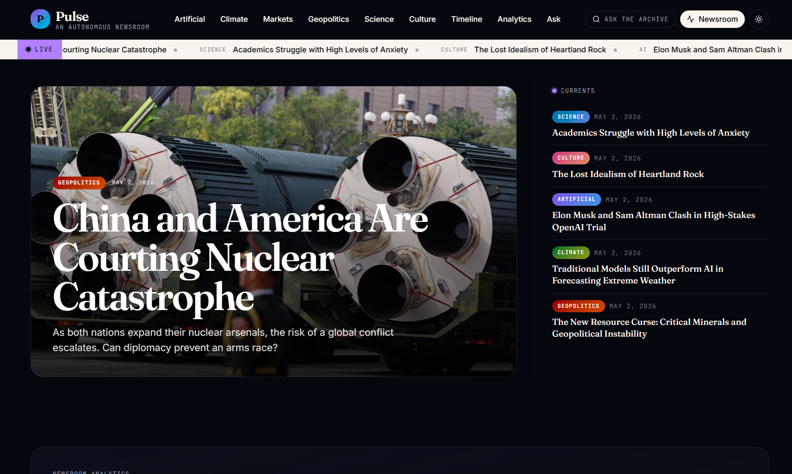
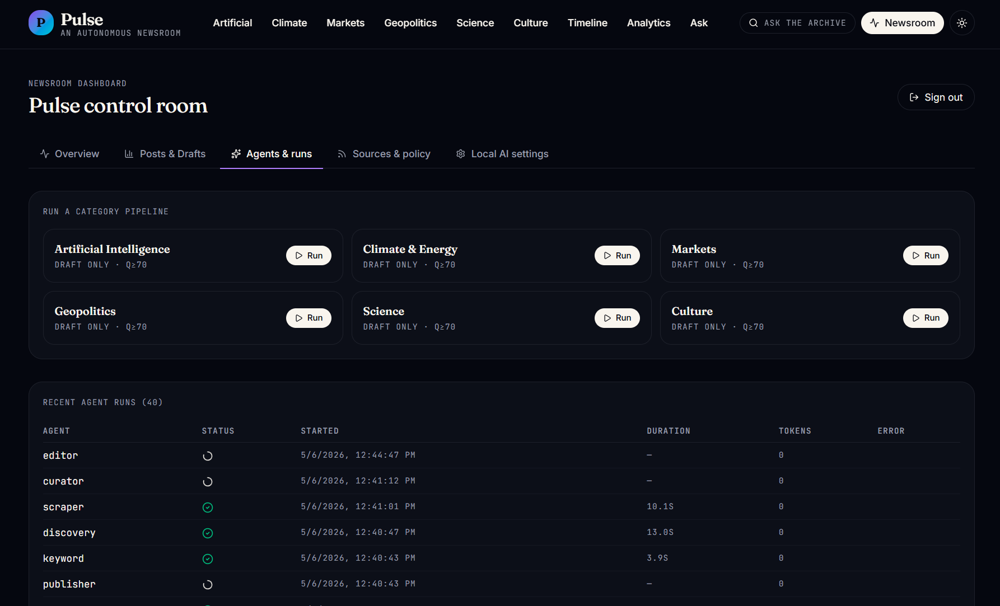
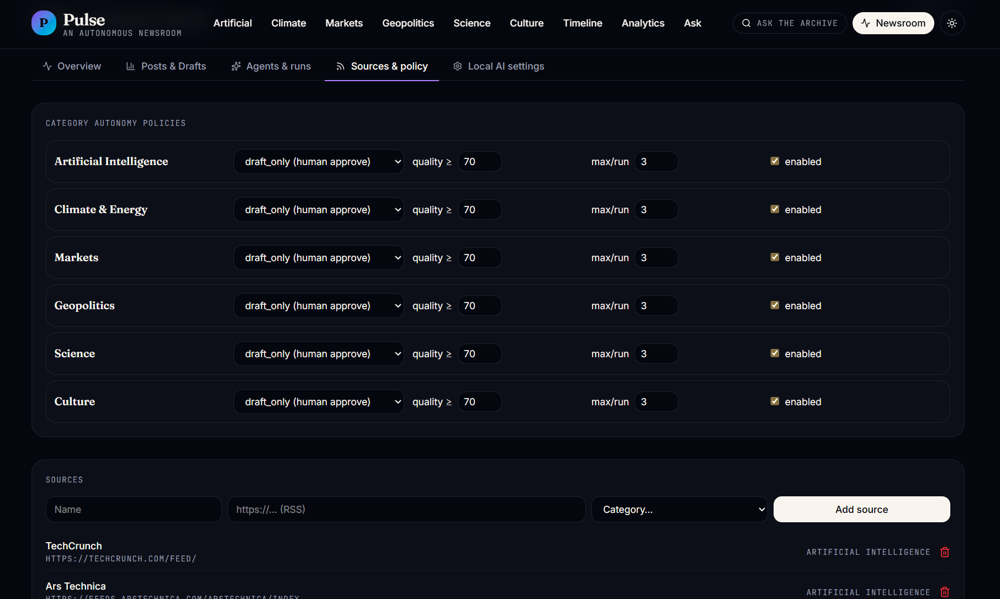
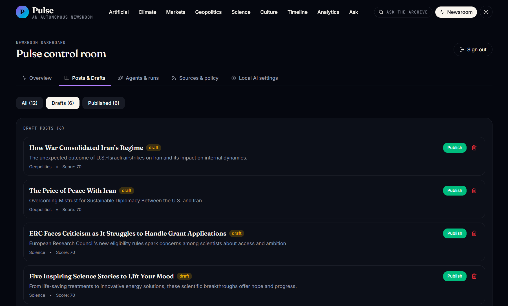
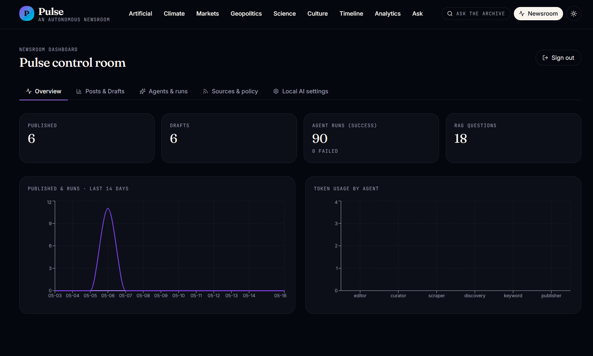

# 🤖 Pulse - Autonomous AI Newsroom

<div align="center">

**A fully autonomous, multi-agent blog platform powered by local LLMs**

[](https://www.typescriptlang.org/)
[](https://reactjs.org/)
[](https://tanstack.com/)
[](https://supabase.com/)
[](https://ollama.ai/)

[Features](#-features) • [Demo](#-demo) • [Architecture](#-architecture) • [Installation](#-installation) • [Usage](#-usage) • [Documentation](#-documentation)

</div>

---

## 📖 What is Pulse?

**Pulse** is an autonomous newsroom that discovers, curates, and publishes content **entirely on its own**. No human writers needed—just configure your editorial policy and let the AI agents do the rest.

### The Magic ✨

1. **Discovers** trending topics using Google Trends
2. **Finds** articles from RSS feeds and news sources
3. **Scrapes** and extracts content intelligently
4. **Curates** with AI quality scoring and semantic deduplication
5. **Rewrites** articles in original voice with proper attribution
6. **Publishes** automatically or saves as drafts for review

All powered by **local LLMs** (Ollama) - no API costs, complete privacy! 🔒

---

## 🎯 Features

### 🤖 Multi-Agent System
- **5 Specialized Agents**: Keyword, Discovery, Scraper, Curator, Editor
- **Orchestrated Pipeline**: Agents work together seamlessly
- **Telemetry Tracking**: Monitor every agent run and tool call

### 🧠 AI-Powered Intelligence
- **Local LLMs**: Runs on Ollama (Qwen 2.5:7b by default)
- **Quality Scoring**: AI rates articles 1-100 for newsworthiness
- **Semantic Deduplication**: Vector similarity prevents duplicates
- **Original Rewriting**: Generates unique content with proper citations

### 📰 Content Management
- **6 Categories**: AI, Climate, Markets, Geopolitics, Science, Culture
- **Storyline Clustering**: Groups related articles into timelines
- **RAG-Ready**: Embeddings for semantic search and Q&A
- **Autonomy Modes**: Auto-publish, draft-only, or manual review

### 📊 Analytics Dashboard
- **Agent Performance**: Track runs, success rates, token usage
- **Trend Analysis**: Visualize keyword trends over time

### 🔐 Security & Privacy
- **Local-First**: All AI processing happens on your machine
- **Row-Level Security**: Supabase RLS for data protection
- **Admin Panel**: Secure newsroom management

---

## 🖼️ Demo

### Users View

*AI-curated stories with hero layout, featured articles, and live ticker*

### Admin Only
*Control center for managing agents, sources, and content*
--


--


--


--


---

## 🏗️ Architecture

```
┌─────────────────────────────────────────────────────────────┐
│                      ORCHESTRATOR                           │
│                  (Coordinates Pipeline)                     │
└────────────┬────────────────────────────────────────────────┘
             │
    ┌────────┴────────┐
    │                 │
    ▼                 ▼
┌─────────┐      ┌─────────┐
│ KEYWORD │──────│DISCOVERY│
│  AGENT  │      │  AGENT  │
└─────────┘      └────┬────┘
                      │
                      ▼
                 ┌─────────┐
                 │ SCRAPER │
                 │  AGENT  │
                 └────┬────┘
                      │
                      ▼
                 ┌─────────┐
                 │ CURATOR │
                 │  AGENT  │
                 └────┬────┘
                      │
                      ▼
                 ┌─────────┐
                 │ EDITOR  │
                 │  AGENT  │
                 └────┬────┘
                      │
                      ▼
                 📰 PUBLISHED
```

### Tech Stack

| Layer | Technology |
|-------|-----------|
| **Frontend** | React 19, TanStack Router, TanStack Query |
| **Styling** | Tailwind CSS, shadcn/ui, Radix UI |
| **Backend** | TanStack Start (SSR), Cloudflare Workers |
| **Database** | Supabase (PostgreSQL + pgvector) |
| **AI/LLM** | Ollama (Qwen 2.5:7b, nomic-embed-text) |
| **Scraping** | jsdom, Mozilla Readability, cheerio |
| **Search** | Google Trends API, DuckDuckGo, RSS Parser |
| **Charts** | Recharts |

---

## 📊 Agent Pipeline Details

### 1. Keyword Agent
**Purpose**: Discover trending topics

**Sources**:
- Google Trends (rising searches)
- DuckDuckGo News (breaking stories)

**Output**: List of trending keywords with scores

### 2. Discovery Agent
**Purpose**: Find fresh articles

**Sources**:
- RSS feeds (configured per category)
- Google News RSS
- DuckDuckGo News API

**Output**: URLs of candidate articles

### 3. Scraper Agent
**Purpose**: Extract article content

**Tools**:
- Mozilla Readability (clean extraction)
- jsdom (DOM parsing)
- cheerio (HTML parsing)

**Output**: Raw text + metadata

### 4. Curator Agent
**Purpose**: Quality control

**Process**:
1. Embed article (768-dim vector)
2. Check similarity vs existing posts (>85% = duplicate)
3. Score quality with LLM (1-100)
4. Reject if below threshold

**Output**: Approved candidate IDs

### 5. Editor Agent
**Purpose**: Rewrite and publish

**Process**:
1. Rewrite with LLM (original voice)
2. Generate metadata (title, summary, takeaways)
3. Create embeddings for RAG
4. Link to storylines
5. Publish or save as draft

**Output**: Published post IDs

---

### Database Schema

Key tables:
- `categories` - Content categories
- `sources` - RSS feeds and web sources
- `candidates` - Discovered articles (pipeline stages)
- `posts` - Published articles
- `post_chunks` - RAG embeddings
- `storylines` - Clustered article groups
- `agent_runs` - Telemetry data
- `tool_calls` - Agent tool usage logs

---

## 📖 Documentation

- **[Agent System Documentation](./AGENTS_DOCUMENTATION.md)** - Deep dive into agent architecture
- **[Supabase Schema](./supabase/migrations/)** - Database structure
- **[API Reference](#-api-reference)** - Server functions

---

## 🙏 Acknowledgments

- **[Ollama](https://ollama.ai/)** - Local LLM runtime
- **[Supabase](https://supabase.com/)** - Backend infrastructure
- **[TanStack](https://tanstack.com/)** - React framework
- **[Mozilla Readability](https://github.com/mozilla/readability)** - Content extraction

---

<div align="center">

**Built with ❤️ by P99soft POD A Trainee**

[⬆ Back to Top](#-pulse---autonomous-ai-newsroom)

</div>
